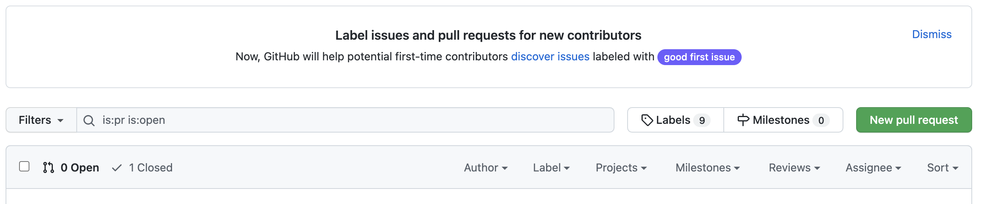

# git-learn

## 1.How to create a request for merge the different branch in github

### 1.1 New the repo on the github

### 1.2 Use git command to download the rep from github to location

### 1.3 Use git command git checkout to creae a new branch

 ### 1.4 Commit  the new Branch in location

### 1.5 Directly Request a Pull Request when the local branch is pushed to remote

### 1.6 Merge the branch by the request pull function of github



## 2.How to merge dev the branch to the specific branch

### 2.1 It needs to commit the dev branch to location

### 2.2 Should pull the dev branch from remote to identify whether some update on current branch

### 2.3 Switch to the specific branch[aim branch]

### 2.4 Use git merge command + dev branch to merge the dev to the aim branch

```tex
Erpengs-MacBook-Pro:idea_workspace erpeng.zhang$ cd git-learn/
Erpengs-MacBook-Pro:git-learn erpeng.zhang$ git add *
Erpengs-MacBook-Pro:git-learn erpeng.zhang$ git branch
* FLASH-GitHub
  main
Erpengs-MacBook-Pro:git-learn erpeng.zhang$ git status
On branch FLASH-GitHub
Changes to be committed:
  (use "git restore --staged <file>..." to unstage)
	modified:   README.md

Untracked files:
  (use "git add <file>..." to include in what will be committed)
	.README.md.swp

Erpengs-MacBook-Pro:git-learn erpeng.zhang$ git commit -m"add some information on how to submit a request PR"
[FLASH-GitHub 1f3c804] add some information on how to submit a request PR
 1 file changed, 19 insertions(+), 1 deletion(-)
Erpengs-MacBook-Pro:git-learn erpeng.zhang$ git log
commit 1f3c804543b3ff3be6153a6c5528fcec677a49bc (HEAD -> FLASH-GitHub)
Author: zhangerpeng <erpeng_zhanggs@163.com>
Date:   Tue Jan 11 23:10:21 2022 +0800

    add some information on how to submit a request PR

commit f6887bf37284eea4591d4c7a95d83a3ecd83de64 (origin/main, origin/HEAD, main)
Author: zhangerpeng <53600581+zhangerpeng@users.noreply.github.com>
Date:   Tue Jan 11 22:54:21 2022 +0800

    Initial commit
Erpengs-MacBook-Pro:git-learn erpeng.zhang$ git push
fatal: The current branch FLASH-GitHub has no upstream branch.
To push the current branch and set the remote as upstream, use

    git push --set-upstream origin FLASH-GitHub

Erpengs-MacBook-Pro:git-learn erpeng.zhang$ git push git push --set-upstream origin FLASH-GitHub
error: src refspec push does not match any
error: failed to push some refs to 'git'
Erpengs-MacBook-Pro:git-learn erpeng.zhang$ git push --set-upstream origin FLASH-GitHub
Enumerating objects: 5, done.
Counting objects: 100% (5/5), done.
Delta compression using up to 12 threads
Compressing objects: 100% (2/2), done.
Writing objects: 100% (3/3), 442 bytes | 442.00 KiB/s, done.
Total 3 (delta 0), reused 0 (delta 0), pack-reused 0
remote: 
remote: Create a pull request for 'FLASH-GitHub' on GitHub by visiting:
remote:      https://github.com/zhangerpeng/git-learn/pull/new/FLASH-GitHub
remote: 
To github.com:zhangerpeng/git-learn.git
 * [new branch]      FLASH-GitHub -> FLASH-GitHub
Branch 'FLASH-GitHub' set up to track remote branch 'FLASH-GitHub' from 'origin'.
Erpengs-MacBook-Pro:git-learn erpeng.zhang$ git logs
git: 'logs' is not a git command. See 'git --help'.

The most similar command is
	log
Erpengs-MacBook-Pro:git-learn erpeng.zhang$ git add *
Erpengs-MacBook-Pro:git-learn erpeng.zhang$ git commit -m"add the folder for image"
[FLASH-GitHub 6c33e82] add the folder for image
 2 files changed, 7 insertions(+), 1 deletion(-)
 create mode 100644 source/reques-pull.png
Erpengs-MacBook-Pro:git-learn erpeng.zhang$ git push
Enumerating objects: 7, done.
Counting objects: 100% (7/7), done.
Delta compression using up to 12 threads
Compressing objects: 100% (4/4), done.
Writing objects: 100% (5/5), 93.28 KiB | 15.55 MiB/s, done.
Total 5 (delta 1), reused 0 (delta 0), pack-reused 0
remote: Resolving deltas: 100% (1/1), completed with 1 local object.
To github.com:zhangerpeng/git-learn.git
   1f3c804..6c33e82  FLASH-GitHub -> FLASH-GitHub
Erpengs-MacBook-Pro:git-learn erpeng.zhang$ git log
commit 6c33e829226539361ae14f5c644787451f421702 (HEAD -> FLASH-GitHub, origin/FLASH-GitHub)
Author: zhangerpeng <erpeng_zhanggs@163.com>
Date:   Tue Jan 11 23:25:53 2022 +0800

    add the folder for image

commit 1f3c804543b3ff3be6153a6c5528fcec677a49bc
Author: zhangerpeng <erpeng_zhanggs@163.com>
Date:   Tue Jan 11 23:10:21 2022 +0800

    add some information on how to submit a request PR

commit f6887bf37284eea4591d4c7a95d83a3ecd83de64 (origin/main, origin/HEAD, main)
Author: zhangerpeng <53600581+zhangerpeng@users.noreply.github.com>
Date:   Tue Jan 11 22:54:21 2022 +0800

    Initial commit
Erpengs-MacBook-Pro:git-learn erpeng.zhang$ git rebase --help
Erpengs-MacBook-Pro:git-learn erpeng.zhang$ clear

Erpengs-MacBook-Pro:git-learn erpeng.zhang$ git add*
git: 'add*' is not a git command. See 'git --help'.

The most similar command is
	add
Erpengs-MacBook-Pro:git-learn erpeng.zhang$ git add *
Erpengs-MacBook-Pro:git-learn erpeng.zhang$ git commit -m"add the information about how to merge branch to master"
[FLASH-GitHub f3dce81] add the information about how to merge branch to master
 1 file changed, 16 insertions(+)
Erpengs-MacBook-Pro:git-learn erpeng.zhang$ git branch
* FLASH-GitHub
  main
Erpengs-MacBook-Pro:git-learn erpeng.zhang$ git push
Enumerating objects: 5, done.
Counting objects: 100% (5/5), done.
Delta compression using up to 12 threads
Compressing objects: 100% (3/3), done.
Writing objects: 100% (3/3), 522 bytes | 522.00 KiB/s, done.
Total 3 (delta 1), reused 0 (delta 0), pack-reused 0
remote: Resolving deltas: 100% (1/1), completed with 1 local object.
To github.com:zhangerpeng/git-learn.git
   6c33e82..f3dce81  FLASH-GitHub -> FLASH-GitHub
Erpengs-MacBook-Pro:git-learn erpeng.zhang$ git switch main 
Switched to branch 'main'
Your branch is up to date with 'origin/main'.
Erpengs-MacBook-Pro:git-learn erpeng.zhang$ git branch
  FLASH-GitHub
* main
Erpengs-MacBook-Pro:git-learn erpeng.zhang$ git pull
hint: Pulling without specifying how to reconcile divergent branches is
hint: discouraged. You can squelch this message by running one of the following
hint: commands sometime before your next pull:
hint: 
hint:   git config pull.rebase false  # merge (the default strategy)
hint:   git config pull.rebase true   # rebase
hint:   git config pull.ff only       # fast-forward only
hint: 
hint: You can replace "git config" with "git config --global" to set a default
hint: preference for all repositories. You can also pass --rebase, --no-rebase,
hint: or --ff-only on the command line to override the configured default per
hint: invocation.
remote: Enumerating objects: 1, done.
remote: Counting objects: 100% (1/1), done.
remote: Total 1 (delta 0), reused 0 (delta 0), pack-reused 0
Unpacking objects: 100% (1/1), 652 bytes | 652.00 KiB/s, done.
From github.com:zhangerpeng/git-learn
   f6887bf..39d6b18  main       -> origin/main
Updating f6887bf..39d6b18
Fast-forward
 README.md | 20 +++++++++++++++++++-
 1 file changed, 19 insertions(+), 1 deletion(-)
Erpengs-MacBook-Pro:git-learn erpeng.zhang$ git merge FLASH-GitHub
Merge made by the 'recursive' strategy.
 README.md              |  24 +++++++++++++++++++++++-
 source/reques-pull.png | Bin 0 -> 116813 bytes
 2 files changed, 23 insertions(+), 1 deletion(-)
 create mode 100644 source/reques-pull.png
Erpengs-MacBook-Pro:git-learn erpeng.zhang$ git log
commit ad5e522f36e1b9f7cd043f6798ddb5d3175de1ae (HEAD -> main)
Merge: 39d6b18 f3dce81
Author: zhangerpeng <erpeng_zhanggs@163.com>
Date:   Tue Jan 11 23:41:35 2022 +0800

    Merge branch 'FLASH-GitHub'
    this demo to practice how to merge

commit f3dce81a1e3d22d9fd9d2c5e3b7e173088acae22 (origin/FLASH-GitHub, FLASH-GitHub)
Author: zhangerpeng <erpeng_zhanggs@163.com>
Date:   Tue Jan 11 23:40:25 2022 +0800

    add the information about how to merge branch to master

commit 6c33e829226539361ae14f5c644787451f421702
Author: zhangerpeng <erpeng_zhanggs@163.com>
Date:   Tue Jan 11 23:25:53 2022 +0800

    add the folder for image

commit 39d6b18c990a19bb1725ed8da1b4dd67fc33d01c (origin/main, origin/HEAD)
Merge: f6887bf 1f3c804
Author: zhangerpeng <53600581+zhangerpeng@users.noreply.github.com>
Date:   Tue Jan 11 23:13:03 2022 +0800

    Merge pull request #1 from zhangerpeng/FLASH-GitHub
    
    add some information on how to submit a request PR

commit 1f3c804543b3ff3be6153a6c5528fcec677a49bc
Author: zhangerpeng <erpeng_zhanggs@163.com>
Date:   Tue Jan 11 23:10:21 2022 +0800

    add some information on how to submit a request PR

commit f6887bf37284eea4591d4c7a95d83a3ecd83de64
Author: zhangerpeng <53600581+zhangerpeng@users.noreply.github.com>
Date:   Tue Jan 11 22:54:21 2022 +0800

    Initial commit
Erpengs-MacBook-Pro:git-learn erpeng.zhang$ git push
Enumerating objects: 1, done.
Counting objects: 100% (1/1), done.
Writing objects: 100% (1/1), 254 bytes | 254.00 KiB/s, done.
Total 1 (delta 0), reused 0 (delta 0), pack-reused 0
To github.com:zhangerpeng/git-learn.git
   39d6b18..ad5e522  main -> main
Erpengs-MacBook-Pro:git-learn erpeng.zhang$ 

```


